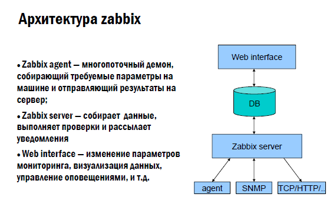

# :pushpin: Основные понятия zabbix:

| Zabbix | Это мощная система мониторинга и управления сетями, серверами и приложениями. Она предоставляет возможность отслеживать производительность и доступность различных компонентов вашей инфраструктуры, а также предупреждать о проблемах и автоматически реагировать на них. |
| :---: | :---: |
| **Сервер Zabbix** | Это центральная часть системы Zabbix, которая отвечает за сбор, хранение и анализ данных мониторинга. Сервер Zabbix обрабатывает запросы от агентов и веб-интерфейса, а также отправляет уведомления о событиях. |
| **Агенты Zabbix** | Это центральная часть системы Zabbix, которая отвечает за сбор, хранение и анализ данных мониторинга. Сервер Zabbix обрабатывает запросы от агентов и веб-интерфейса, а также отправляет уведомления о событиях. |
| **Шаблоны** | Это наборы предопределенных параметров мониторинга, которые можно применить к одному или нескольким узлам. Шаблоны определяют, какие параметры следует мониторить и какие действия предпринимать при возникновении определенных событий. |
| **Триггеры** | Это условия, которые определяют, когда должно быть сгенерировано событие или уведомление. Они могут быть настроены на основе данных, полученных от агентов, и могут активироваться при превышении определенных пороговых значений или при выполнении других условий. |
| **Графики** | Позволяют визуализировать данные мониторинга в виде графиков. Они могут отображать изменение параметров во времени и помогать в анализе производительности и доступности системы. |
| **Уведомления** | Предоставляет возможность настройки уведомлений о событиях, таких как отказы, предупреждения или другие важные события. Уведомления могут быть отправлены по электронной почте, SMS или другими способами связи. |
| **Панель управления** | Это Веб-интерфейс Zabbix предоставляет панель управления, через которую можно настраивать и контролировать систему мониторинга. Он предоставляет доступ к данным мониторинга, настройкам уведомлений, графикам и другим функциям системы. |



# :computer: Инструкция по установке Zabbix на Linux:

```bash
$ apt update
$ apt upgrade
$ wget https://repo.zabbix.com/zabbix/6.4/ubuntu/pool/main/z/zabbix-release/zabbix-release_6.4-1+ubuntu20.04_all.deb  # Скачивание архива zabbix
$ sudo dpkg -i zabbix-release_6.4-1+ubuntu20.04_all.deb  # Распаковываем из архива
$ apt update
$ apt install zabbix-server-mysql zabbix-frontend-php zabbix-apache-conf zabbix-sql-scripts zabbix-agent

https://www.youtube.com/watch?v=H_yhU8Tn8Dg  # 4:52
```
